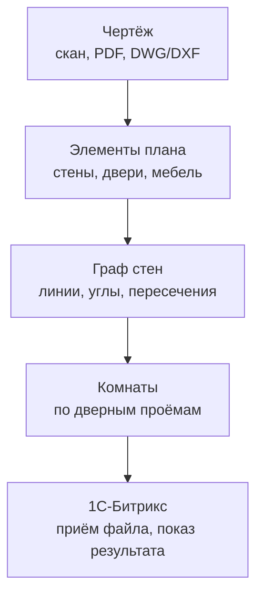

# Распознавание чертежей и интеграция с 1С-Битрикс

Автоматическое распознавание поэтажных планов, векторизация стен и разделение на комнаты — задача, которая распадается на несколько независимых инженерных блоков. Документ описывает рабочие варианты для каждого блока и то, как собрать это в сервис, подключаемый к 1С-Битрикс.

## Нулевой вариант: не строить с нуля

Часть задачи (растровое распознавание планов) уже решают готовые сервисы вроде CubiCasa — API «фото плана → вектор». Если устраивает цена и не критична локализация данных, можно не строить свой CV-пайплайн, а сделать только интеграционный слой поверх готового API. Дальше описан вариант «строим сами».

## Обзор пайплайна

## 1. Формат входного чертежа — от этого зависит вся сложность

Первое, что стоит выяснить: что реально будет приходить на вход, это меняет трудоёмкость на порядок.

- **DWG/DXF (нативный CAD)** — лучший случай. Стены почти всегда лежат на отдельном слое. Парсится напрямую библиотекой `ezdxf`, без ML, точность практически 100%. DWG (бинарный формат) сначала конвертируется в DXF бесплатным ODA File Converter.
- **Векторный PDF** (экспорт из AutoCAD, ArchiCAD, Revit) — тоже содержит реальные линии как объекты, а не пиксели, извлекается через `PyMuPDF` или `pdfplumber`.
- **Скан, фото, растровый PDF** — самый сложный случай и единственный, где реально нужен CV/ML-пайплайн из следующих пунктов.

Разумно сделать роутер по типу файла и для векторных источников идти по «дешёвому» пути. Если чертежи в основном приходят от проектировщиков, часть кейсов закрывается почти без ML.

Если на вход будет попадать не только сам план, а целый комплект документов (фасады, разрезы, узлы), стоит добавить самый первый лёгкий шаг — классификатор «это вообще поэтажный план?». Для такой грубой классификации целого листа хватит небольшой CNN или даже zero-shot через vision-модель — точная геометрия здесь не нужна, только тип листа.

## 2. Распознавание элементов: стены, перегородки, мебель, проёмы

Для растровых чертежей — три рабочих варианта.

### Вариант A — классический CV, без обучения

Толщина линии — главный признак: несущие стены рисуют толще перегородок, а те заметно толще мебели и размерных линий. Через морфологические операции и анализ связных компонент можно грубо отделить конструктив от всего остального, `cv2.HoughLinesP` выделяет прямые отрезки. Двери узнаются по сочетанию дуги и прямой (полотно) либо просто по разрыву в линии стены.

Плюс — не нужна разметка, предсказуемо на чистых чертежах. Минус — мебель слишком разнородна для одной геометрической эвристики.

### Вариант B — сегментационная нейросеть

Референс — модель DeepFloorplan (мульти-таск сеть: одна ветка размечает стены/двери/окна, вторая — типы помещений) и датасет CubiCasa5k (около 5000 размеченных планов со слоями стен, проёмов и мебельных иконок) как база для дообучения. На PyTorch `segmentation-models-pytorch` даёт готовые U-Net, DeepLabV3+, FPN.

Устойчивее на «грязных» сканах и фото, но почти наверняка потребует дообучения на своих данных — стили черчения слишком разные, чтобы CubiCasa5k хватило само по себе.

### Вариант C — гибрид (рекомендуемый)

Геометрию стен и перегородок — классикой (вариант A), там простая объяснимая логика работает надёжно. Мебель и сантехнику — отдельным детектором объектов (YOLOv8 или YOLOv11), это дискретные предметы с понятными классами, и object detection сразу даёт bounding box для исключения из маски стен.

Для старта без своей разметки — связка Grounding DINO и SAM (Segment Anything Model от Meta), «Grounded-SAM»: по текстовому промпту вроде «sofa» или «sink» находит и сегментирует объекты без обучения — не идеально точно, но закрывает MVP, пока не накопится своя разметка.

Если основной поток чертежей окажется в виде DWG/DXF, этот блок в продакшене может вообще не понадобиться — вектор уже содержит нужные слои.

## 3. Векторизация стен

Маску «стена/перегородка» нужно превратить в линии, которые можно рисовать поверх чертежа:

1. Скелетизация (`skimage.morphology.skeletonize`) сводит толстую линию к линии в один пиксель.
2. Библиотека `skan` разбирает скелет в граф — узлы (концы и точки ветвления) и рёбра (пути между ними).
3. Каждое ребро упрощается алгоритмом Дугласа-Пекера (`cv2.approxPolyDP` или `shapely` `.simplify()`) — убирает шум пикселей, оставляет прямые отрезки.
4. Толщина стены восстанавливается через `cv2.distanceTransform` вдоль центральной линии — пригодится, если на выходе нужны не осевые линии, а полноценные полигоны стен.

Результат этого шага — набор отрезков, который ложится SVG-оверлеем поверх исходного скана.

## 4. Углы и пересечения

На практике здесь не два случая, а три:

| Тип стыка | Что происходит | Как обрабатывается |
|---|---|---|
| Угол (L) | Два отрезка сходятся концами | Концы стягиваются в одну точку — «замыкание» |
| Примыкание (T) | Конец одного отрезка попадает в середину другого | Конец проецируется перпендикулярно на линию, сквозная стена остаётся непрерывной |
| Пересечение (X) | Оба отрезка проходят серединами друг через друга | Линии пересекаются как есть, без слияния в точку |

Отличить эти случаи программно можно по одному признаку: в какую точку параметра t∈[0,1] вдоль каждого отрезка попадает точка сближения. t≈0 или t≈1 — это «конец» отрезка (даёт L или T), t заметно между 0 и 1 — «середина» (даёт T или X). Дальше — просто комбинация «конец-конец» / «конец-середина» / «середина-середина».

Технически: `shapely` — `STRtree` для поиска близких пар отрезков, `shapely.ops.snap` для стягивания концов в пределах допуска; `networkx` — чтобы хранить результат как граф (узлы — точки стыков, рёбра — сами стены со свойством толщины). Допуск снапа стоит завязывать на масштаб чертежа или толщину стены, а не на фиксированное число пикселей, иначе всё сломается на чертеже с другим масштабом.

## 5. Разделение на комнаты по дверным проёмам

Когда граф стен собран и углы замкнуты:

1. Дверные и оконные проёмы (найденные на шаге 2) — это разрывы в линии стены. Для расчёта площади помещений их временно «закрывают» виртуальным отрезком.
2. `shapely.ops.polygonize()` (или `polygonize_full`, которая дополнительно возвращает незамкнутые «хвосты» — удобно для отладки, если где-то не сошлась геометрия) на полном наборе отрезков сразу отдаёт готовые замкнутые полигоны — это и есть комнаты.
3. Если, кроме площади, нужна связность — какая комната через какую дверь соединяется с какой, — двери держат отдельным типом ребра («проходимое», в отличие от глухой стены) и строят двойственный граф: комната-узел, дверь-ребро между узлами. Как альтернатива `shapely` — можно остаться в графовой модели через `networkx.PlanarEmbedding` и обход граней.
4. Подпись комнат («кухня», «спальня») — если текст есть на чертеже, OCR (Tesseract с языковым пакетом rus) по области рядом с центроидом полигона; если текста нет, эвристика по площади и найденной внутри сантехнике или мебели (санузел узнаётся по унитазу и раковине, а не по подписи).

## 6. Мебель отдельно от стен

Детекция из пункта 2 уже даёт нужное для «отделения» — bounding box и класс каждого объекта. Дальше эти области просто исключаются из маски перед векторизацией стен, чтобы мебель не путалась с перегородками.

Сами найденные объекты стоит сохранить в результате отдельно: если конечная цель — дать клиенту расставить в очищенном плане товары из каталога (учитывая интеграцию с Битриксом, похоже на мебельный или ремонтный бизнес), эти данные всё равно понадобятся.

## 7. Формат результата

На выходе пайплайна разумно отдавать:

- **SVG** — сразу рисуется в браузере, удобно наложить как оверлей поверх исходного скана для визуальной проверки.
- **JSON** — отрезки стен с толщиной, полигоны комнат с площадью и меткой, проёмы с указанием, какие два помещения они соединяют, объекты мебели с классом и координатами. Это и есть контракт API для фронтенда — планировщика, 3D-конфигуратора, калькулятора материалов.
- **DXF на выходе**, если план дальше уходит обратно в CAD (`ezdxf` умеет и записывать, не только читать).

## 8. Интеграция с 1С-Битрикс

Битрикс — PHP, тяжёлые CV/ML-вычисления туда закладывать не стоит: моделям, тем более на GPU, нечего делать внутри PHP-процесса Apache или php-fpm. Рабочая схема:

- Отдельный Python-микросервис (FastAPI) со всеми моделями и геометрической логикой (`shapely`/`networkx`), наружу — REST: загрузка файла → JSON + SVG.
- Со стороны Битрикса — тонкий модуль-клиент: принимает файл через обычную форму или свойство инфоблока типа «файл», прокидывает его в микросервис через `\Bitrix\Main\Web\HttpClient`, результат складывает в свою таблицу (D7 ORM, `\Bitrix\Main\Entity`) или в свойства элемента инфоблока, рендерит в компоненте на сайте.
- Обязательно асинхронно: распознавание может занимать секунды-десятки секунд, блокировать на это PHP-запрос нельзя. Микросервис сразу возвращает `job_id` и обрабатывает в фоне, Битрикс либо опрашивает статус, либо принимает вебхук-колбэк на свой REST-эндпоинт по готовности (для регулярных фоновых задач в Битриксе есть агенты — `CAgent`).
- Файлы лучше гонять не синхронно через тело HTTP-запроса, а через общее S3-совместимое хранилище (Яндекс Object Storage, VK Cloud, Selectel) — микросервис и Битрикс оба туда достучатся, и большие сканы не упрутся в PHP-таймауты.
- Микросервис — в Docker, между ним и Битриксом — токен-авторизация. Если в итоге это не классическое «Управление сайтом», а приложение для Bitrix24 — архитектура та же самая, разве что интеграция изначально идёт через REST/вебхуки, ещё более отвязанно от PHP-кода.

## 9. Практический план внедрения

Чтобы не пытаться сразу построить идеальный пайплайн:

1. Парсинг векторных форматов (DXF, векторный PDF) — рабочий MVP почти без ML, если хотя бы часть чертежей приходит не сканами.
2. Классика (вариант A из пункта 2) — для чистых сканов и растровых PDF.
3. ML-сегментация и детектор мебели — для сложных или фотографированных чертежей и там, где классика ошибается.
4. Интерфейс ручной правки — не опция, а обязательная часть системы. Даже у коммерческих продуктов в этой нише распознавание не работает как чёрный ящик со стопроцентной точностью — везде есть шаг подтверждения человеком. Стоит закладывать это в архитектуру сразу (простой веб-редактор: подвинуть узел, разорвать или добавить стену), а не как запасной план на случай, если «не справилось».
